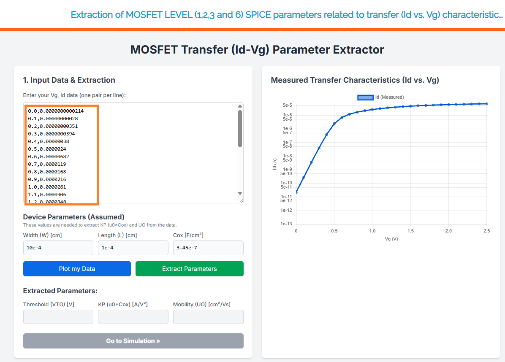
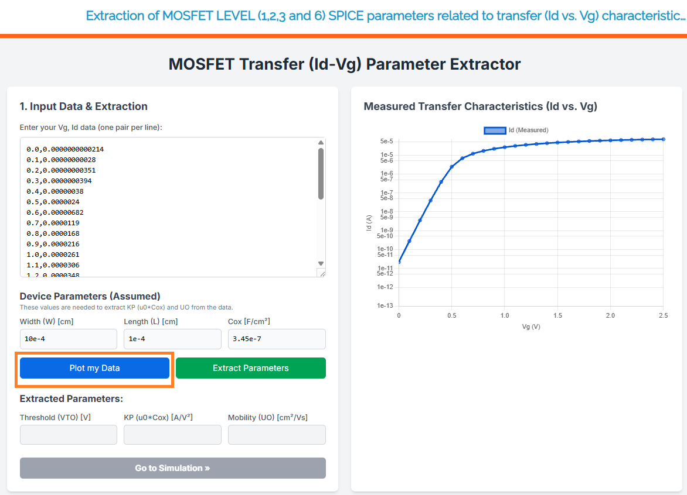
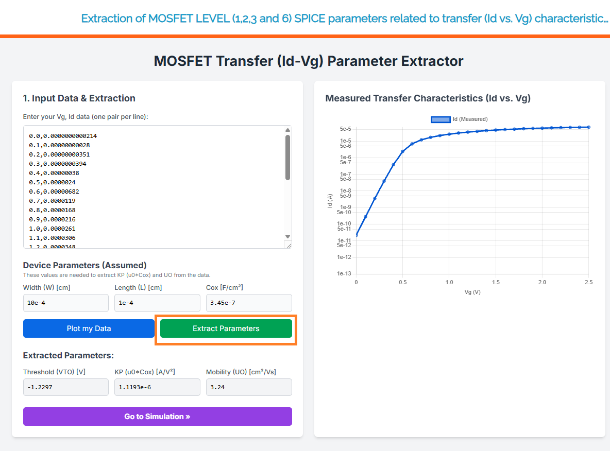
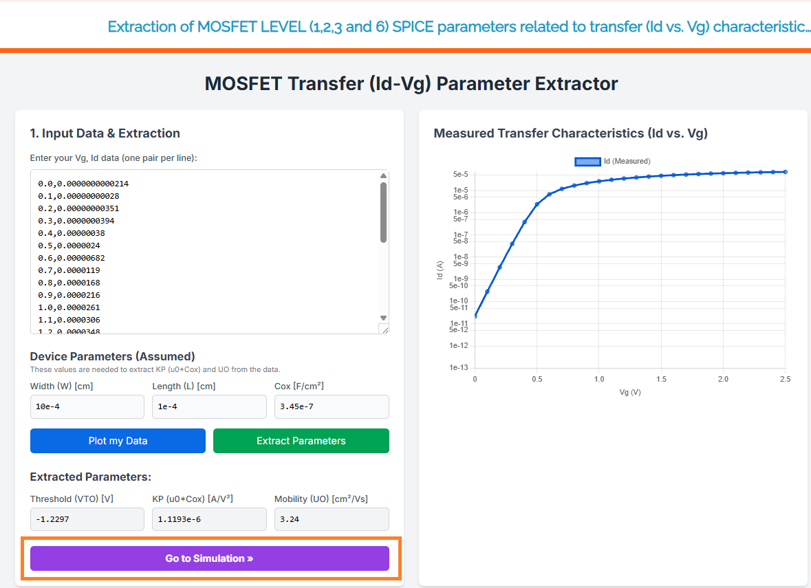
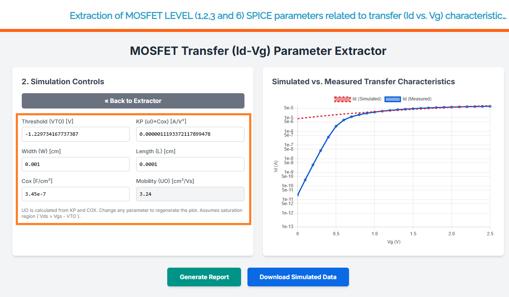
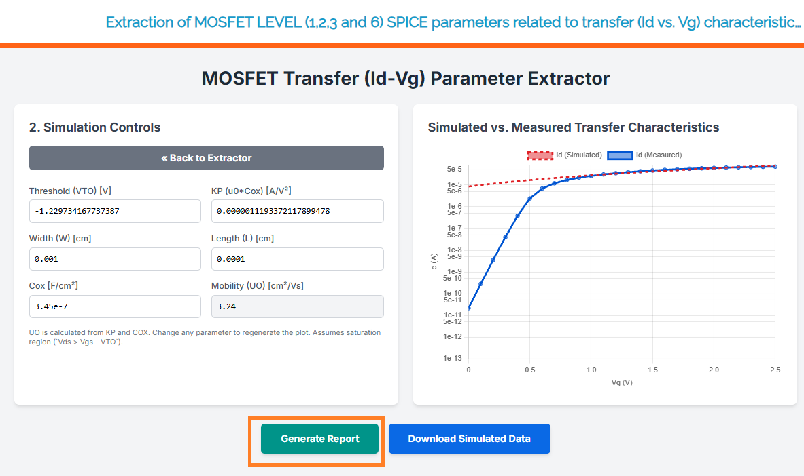
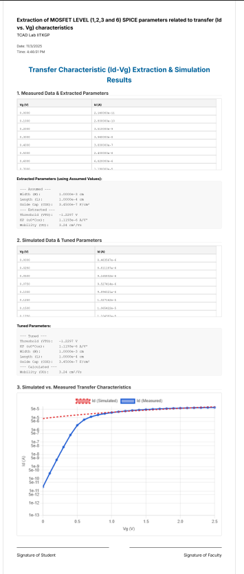
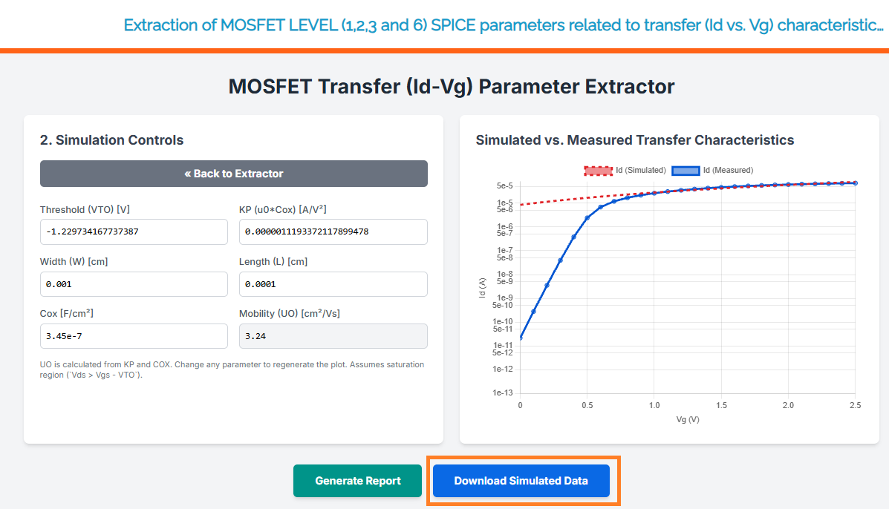
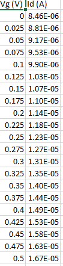

# Simulation Procedure

Follow these steps to complete your simulation and generate a report.

---

1.  **Import Data**
    Import your data generated by the instrument. Directly copy and paste it into the data window. (A sample data set is already given as a reference).
    

    
    

2.  **Plot Data**
    Plot your own data by pressing the "**Plot My Data**" button.
    

    
    

3.  **Extract Parameters**
    By clicking the "**Extract Parameters**" button, you can now extract the desired parameters from your data.
    

    
    

4.  **Go to Simulation Window**
    Go to the simulation window by clicking the "**Go to Simulation**" button.
    

    
    

5.  **Tune Parameters**
    Tune the parameters of your output data as required.
    

    
    

6.  **Generate Report**
    Click the "**Generate Report**" button to generate the report.
    

    
    

7.  **Find PDF Report**
    Go to the download section and find the downloaded PDF report.
   

    
    

8.  **Download Simulated Data**
    Click the "**Download Simulated Data**" button to get the simulated data.
   

    
    

9.  **Find Data File**
    Go to the download section and find the downloaded data file.
    

    
    

    
