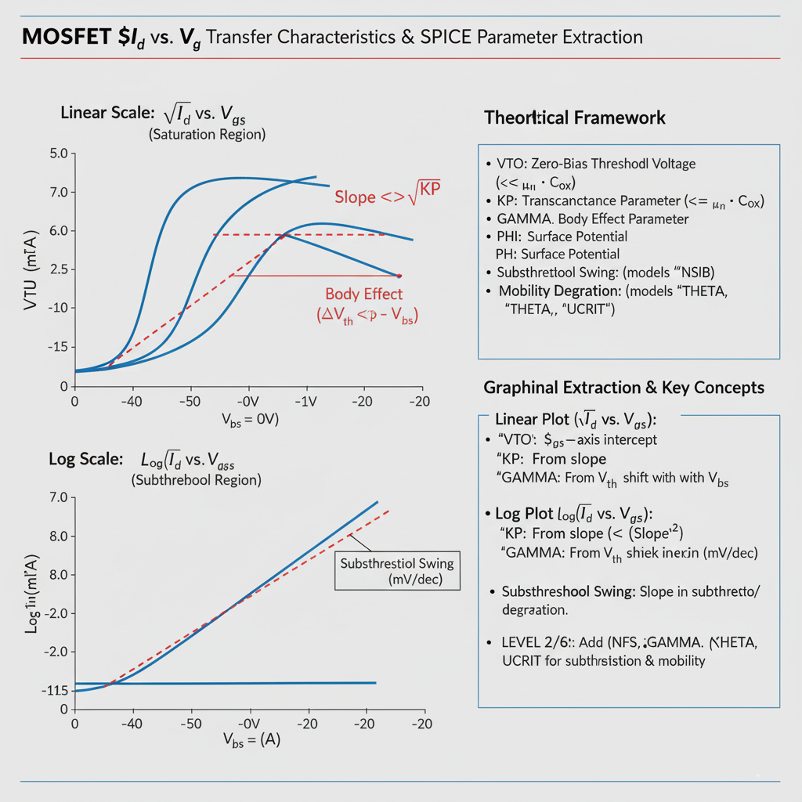

## Theory
**Introduction:**  
MOSFET Parameter Extraction from Transfer ($I_d$ vs. $V_g$) Characteristics

      
      
<strong>Fig. 1. MOSFET $I_d$ vs. $V_g$ Transfer Characteristics & SPICE Parameter Extraction</strong>

## Introduction

The **transfer characteristic** (or $I_d$ vs. $V_g$) is a fundamental plot used to characterize a MOSFET and extract key SPICE parameters. It shows how the gate-source voltage ($V_{gs}$) controls the drain current ($I_d$).

This measurement is typically performed in two ways, each revealing different parameters:
1.  **Linear Scale ($I_d$ vs. $V_g$):** Used to analyze the "on-state" behavior and extract threshold voltage and transconductance.
2.  **Log Scale ($log(I_d)$ vs. $V_g$):** Used to analyze the "off-state" or "subthreshold" behavior and extract leakage and turn-off characteristics.

This document covers the extraction of parameters for SPICE LEVEL 1, 2, 3, and 6 models, which build upon each other in complexity.

---

## 1. Linear Region Extraction (`VTO`, `KP`) - LEVEL 1

The most basic parameters, `VTO` (threshold voltage) and `KP` (transconductance parameter), are extracted from the "on" region of the transfer curve. This is best done with the device in the **saturation region** to get a clear square-law relationship.

* **Measurement Setup:**
    * Set $V_{ds}$ to a high, constant voltage (e.g., $V_{ds} = V_{dd}$) to ensure the device is in saturation.
    * Sweep $V_{gs}$ from 0V up to $V_{dd}$.
    * Plot the **square root of $I_d$** (y-axis) vs. **$V_{gs}$** (x-axis).

* **`VTO` (Zero-Bias Threshold Voltage):**
    * **Theory:** In the simple (LEVEL 1) model, the saturation current is $I_d \propto (V_{gs} - VTO)^2$. Taking the square root gives $\sqrt{I_d} \propto (V_{gs} - VTO)$.
    * **Extraction:** The plot of $\sqrt{I_d}$ vs. $V_{gs}$ will be a straight line in the strong inversion (on) region. Extrapolate this straight line down to the x-axis (where $I_d = 0$).
    * The x-intercept is the **`VTO`** (threshold voltage).

* **`KP` (Transconductance Parameter):**
    * **Theory:** The `KP` parameter (also known as $k'$) is $KP = \mu_n \cdot C_{ox}$, representing the gain of the device. The slope of the $\sqrt{I_d}$ vs. $V_{gs}$ line is:
        $$\text{Slope} = \sqrt{\frac{KP}{2} \cdot \frac{W}{L}}$$
    * **Extraction:** Measure the slope of the linear portion of the $\sqrt{I_d}$ vs. $V_{gs}$ plot.
    * Knowing the device's as-drawn width ($W$) and length ($L$), you can solve for **`KP`**.

---

## 2. Body Effect (`GAMMA`, `PHI`) - LEVEL 1, 2, 3

The body effect describes how the threshold voltage (`VTO`) *changes* when the substrate (or "body") is not at the same potential as the source.

* **Measurement Setup:**
    * Repeat the entire $I_d$ vs. $V_{gs}$ measurement (from Step 1) for several different, constant **substrate-source voltages** ($V_{bs}$). For an NMOS, $V_{bs}$ will be 0V, -1V, -2V, etc.
    * For each $V_{bs}$ value, extract a new threshold voltage ($V_t$).

* **`GAMMA` (Body Effect Parameter) & `PHI` (Surface Potential):**
    * **Theory:** The threshold voltage changes with $V_{bs}$ according to the equation:
        $$V_t = VTO + GAMMA \cdot (\sqrt{PHI - V_{bs}} - \sqrt{PHI})$$
        (Note: $V_{bs}$ is negative, so the term under the square root increases).
    * **Extraction:**
        1.  `PHI` is a physical parameter (e.g., ~0.6V for silicon) that can be co-extracted or set to a reasonable value.
        2.  Create a new plot of the extracted **$V_t$** (y-axis) versus **$(\sqrt{PHI - V_{bs}} - \sqrt{PHI})$** (x-axis).
        3.  This plot will be a straight line. The slope of this line is the **`GAMMA`** parameter.

---

## 3. Subthreshold Region (`NFS`) - LEVEL 2, 3, 6

This region models the "leakage" current that flows even when the gate voltage is below the threshold voltage.

* **Measurement Setup:**
    * Use the same data as in Step 1 (measured at a low, constant $V_{ds}$ in the *linear* region is often preferred).
    * Plot the **$log_{10}(I_d)$** (y-axis) vs. **$V_{gs}$** (x-axis).

* **Subthreshold Swing (S.S.) & `NFS`:**
    * **Theory:** In the subthreshold region ($V_{gs} < VTO$), the drain current is exponential. On a semi-log plot, this appears as a straight line. The steepness of this line is the **Subthreshold Swing (S.S.)**, measured in **millivolts per decade** (mV/dec) of current. A "perfect" switch has a slope of ~60 mV/dec. A "leaky" switch has a much higher slope (e.g., 100+ mV/dec).
    * **Extraction:**
        1.  Measure the slope of the $log(I_d)$ vs. $V_g$ curve in the linear subthreshold region.
        2.  This slope (S.S.) is used to derive parameters like **`NFS`** (Fast Surface State density) in LEVEL 3, or `NSUB` (Substrate Doping) in LEVEL 2, which the model uses to internally calculate the subthreshold behavior.

---

## 4. Mobility Degradation (`THETA`, `UCRIT`) - LEVEL 2, 3, 6

The simple LEVEL 1 model assumes mobility (`KP`) is constant. In reality, at high gate voltages, the strong vertical electric field pulls carriers against the oxide, causing them to scatter and slow down. This reduces mobility and, therefore, reduces the current.

* **Effect on Plot:**
    * On the **$I_d$ vs. $V_g$** (linear) plot, the curve will bend *downward* (compress) at high $V_g$, showing less "gain" than the simple model predicts.
    * On the **$\sqrt{I_d}$ vs. $V_g$** plot, the line will curve over instead of remaining perfectly straight.

* **Extraction:**
    * **Theory:** This mobility degradation is modeled differently by each level:
        * **LEVEL 2:** Uses `UCRIT` (Critical Field) to model this reduction.
        * **LEVEL 3:** Uses `THETA` (Mobility Degradation Factor) for a simpler, empirical fit.
        * **LEVEL 6 (BSIM):** Uses more complex, physically-based mobility models.
    * **Extraction:** These parameters are **fitting parameters**. They are extracted by using a numerical optimizer to fit the chosen model's equation (e.g., LEVEL 3) to the measured $I_d$ vs. $V_g$ curve in the high-$V_g$, strong-inversion region. The value of `THETA` is adjusted until the model's "roll-off" matches the measured data's "roll-off."

## Summary of Model Progression

* **LEVEL 1:** Extracts the "first-order" parameters: `VTO`, `KP`, `GAMMA`. It does not model subthreshold current or mobility degradation.
* **LEVEL 2:** A more physical model that *attempts* to derive all effects from basic parameters (`NSUB`, `UCRIT`, etc.). It inherently models subthreshold swing and mobility degradation.
* **LEVEL 3 & 6:** Semi-empirical models that add specific fitting parameters (`NFS`, `THETA`) to more accurately and reliably fit the measured subthreshold and mobility degradation effects seen on the $I_d$ vs. $V_g$ transfer characteristic.
* 
     
 
